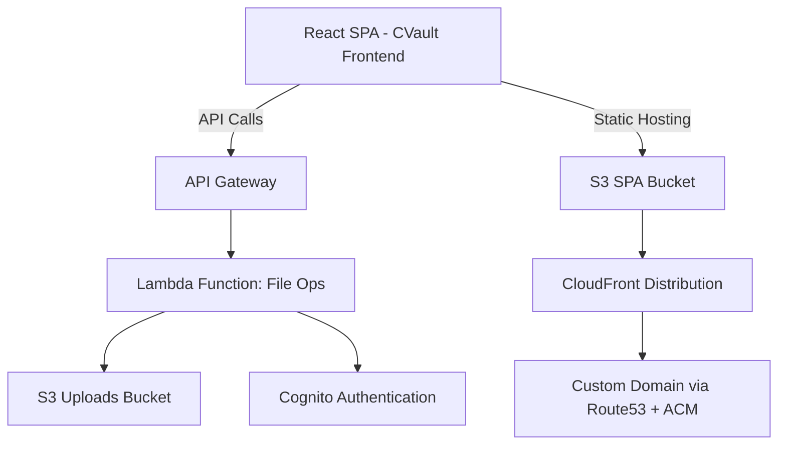
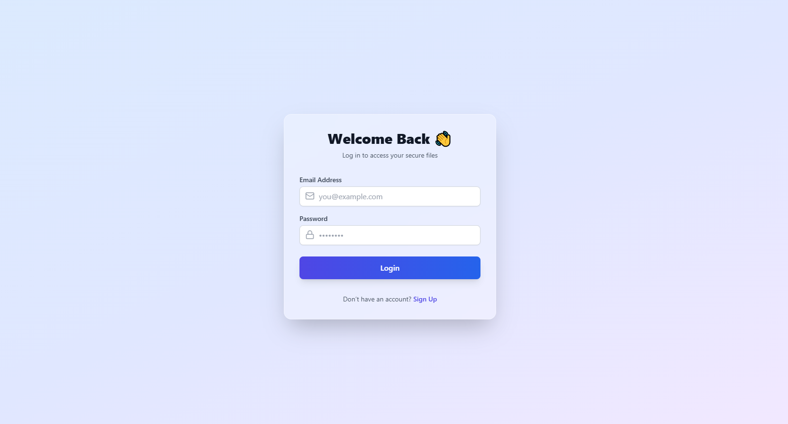
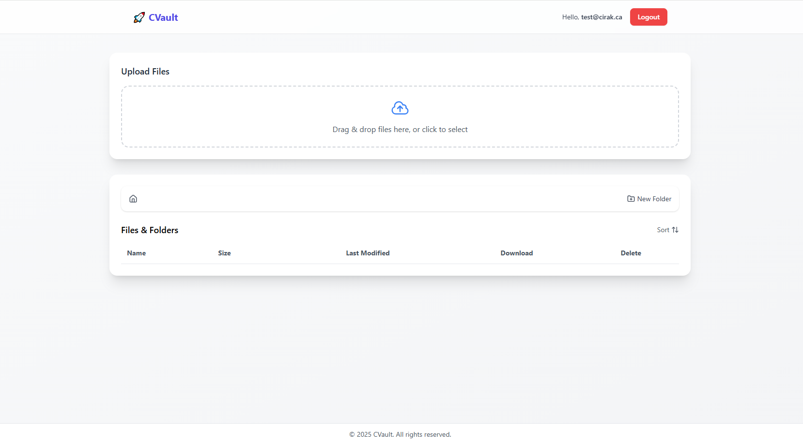

# CVault 🚀  
**A Secure File Vault powered by AWS & Terraform**

CVault is a cloud-based file management system that allows users to securely upload, organize, and access files via a React Single Page Application (SPA).  
It leverages **AWS serverless architecture** and is fully managed with **Terraform Infrastructure as Code (IaC)**.  

---

## 🌟 Features
- 🔑 **User Authentication** with AWS Cognito (email + password, signup & login flow)  
- ☁️ **File Storage** on Amazon S3 with private access via CloudFront  
- 📂 **Folder Management** (create/delete folders)  
- ⬆️ **Secure File Uploads** using presigned URLs  
- ⬇️ **File Downloads** with time-limited links  
- ❌ **Safe Deletions** (single file or recursive folder delete)  
- 🔐 **Authorization**: Each user can only access their own files  
- 📊 **Modern UI**: React + Tailwind with responsive design  

---

## 🏗️ Architecture


---

## ⚙️ Tech Stack

### **Frontend**
- React (SPA) + Tailwind CSS  
- Lucide & Heroicons (UI icons)  
- `react-dropzone` (drag & drop file uploads)  

### **Backend & Infrastructure**
- **AWS S3** → file storage + SPA hosting  
- **AWS CloudFront** → global CDN with SSL  
- **AWS Cognito** → authentication & user management  
- **AWS API Gateway** → REST API  
- **AWS Lambda** → file operations logic  
- **AWS Route53 + ACM** → custom domain + TLS certificates  
- **Terraform** → Infrastructure as Code (AWS provider v5.x)  

---

## 📷 Demo Screenshots

### 🔑 Authentication
Signup & Login with AWS Cognito  
  


### ⬆️ File Upload
Drag & drop file upload with real-time progress  


### 📂 File Management
Browse, create, and delete files & folders  
  
  


### 📊 Dashboard
Modern React + Tailwind interface for browsing files  


---

## 🔑 Demo Access

You can try CVault live at: [https://cvault.cirak.ca](https://cvault.cirak.ca)

**Demo Credentials**  
- 📧 Email: `test@cirak.ca`  
- 🔑 Password: `Hello123.`

⚠️ *This demo account is public and intended for testing only.  
Please do not upload sensitive or personal files.*

---

## 📂 Project Structure
```
cvault/
│
├── infra/                      # Terraform Infrastructure
│   ├── main.tf
│   ├── variables.tf
│   ├── outputs.tf
│   ├── s3.tf
│   ├── s3_uploads.tf
│   ├── cloudfront.tf
│   ├── cognito.tf
│   ├── api_gateway.tf
│   ├── lambda.tf
│   ├── iam.tf
│   ├── route53.tf
│   ├── acm.tf
│   ├── random.tf
│   └── terraform.tfvars        # (gitignored)
│
├── frontend/                   # React SPA
│   ├── public/
│   ├── src/
│   │   ├── components/         # UI components (Upload, Table, Toolbar, Modals, Auth)
│   │   ├── services/           # API calls (api.js)
│   │   ├── App.js
│   │   └── index.js
│   └── .env.example            # Example env file
│
├── .gitignore
├── README.md
└── LICENSE (optional)
```

---

## 🚀 Getting Started

### **1. Clone repository**
```bash
git clone https://github.com/SinanCirak/cvault.git
cd cvault
```

### **2. Setup Infrastructure (Terraform)**
```bash
cd infra
terraform init
terraform plan
terraform apply
```

### **3. Setup Environment Variables (Frontend)**

Create a `.env` file inside `frontend/`:

#### Vite (default):
```env
VITE_COGNITO_USER_POOL_ID=ca-central-1_xxxxxx
VITE_COGNITO_CLIENT_ID=xxxxxxxxxxxxxxxxxxxx
VITE_API_BASE=https://<api-id>.execute-api.ca-central-1.amazonaws.com/dev
```

#### CRA (if used):
```env
REACT_APP_COGNITO_USER_POOL_ID=ca-central-1_xxxxxx
REACT_APP_COGNITO_CLIENT_ID=xxxxxxxxxxxxxxxxxxxx
REACT_APP_API_BASE=https://<api-id>.execute-api.ca-central-1.amazonaws.com/dev
```

### **4. Run Frontend**
```bash
cd frontend
npm install
npm run dev   # (or npm start if CRA)
```

---

## 🔒 Security
- Cognito ensures only authenticated users can access APIs.  
- Each user is isolated by S3 prefix (`users/<cognito-sub>/`).  
- All S3 buckets block public access (CloudFront + OAC only).  
- CORS is enabled only for required methods.  

---

## 📈 Future Improvements
- Versioning support for uploads (keep file history)  
- Advanced sharing (invite users, signed share links)  
- Multi-region replication for uploads  
- Integration with DynamoDB for metadata tracking  

---

## 👤 Author
**Sinan Cirak**  
- 🌐 [Portfolio](https://cirak.ca)  
- 💼 [LinkedIn](https://www.linkedin.com/in/sinan-cirak/)  
